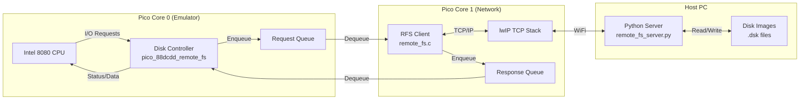

# Raspberry Pi Pico Altair 8800

## Project Heritage

This project is a microcontroller implementation of the [Altair 8800 Emulator on Embedded Linux](https://github.com/gloveboxes/Altair-8800-Emulator).

## Clone With Submodules

This project bundles Pimoroni's Pico helper libraries as a git submodule.
Clone (or update) with:

```shell
git clone --recurse-submodules https://github.com/gloveboxes/pico-altair-8800.git
```

## Serial Terminal

### macos

1. screen /dev/tty.usbmodem101 115200
   
   - screen is built into macOS
   - Exit: Press <kbd>ctrl+c</kbd> then <kbd>K</kbd>

2. picocom /dev/tty.usbmodem101 -b 115200

    - Install

        ```shell
        brew install picocom
        ```

    - Exit: Press <kbd>ctrl+a</kbd>, then <kbd>ctrl+x</kbd>


## Wi-Fi Console

For WiFi-enabled boards (Pico W, Pico 2 W):

1. WiFi credentials are configured at runtime via a serial terminal app (see WIFI_CONFIG_README.md for details)
   - Connect using `picocom /dev/tty.usbmodem101 -b 115200` or `screen /dev/tty.usbmodem101 115200`
   - Follow the on-screen prompts to configure WiFi SSID and password
2. On boot the Pico W connects to Wi-Fi and starts a WebSocket console on port `8088`
3. Point a browser at `http://<pico-ip>:8088/` to load the bundled console UI, or use any WebSocket-capable client (e.g., `wscat`) to connect to `ws://<pico-ip>:8088/` and interact with the Altair terminal alongside USB serial

## SD Card Support

### Pico Pins


### Overview

The Altair 8800 emulator supports SD card storage for reading/writing disk images and other files. SD card support is optional and enabled with `-DSD_CARD_SUPPORT=ON` at compile time.

### Hardware Wiring (Pololu SD Card Breakout)

The SD card interface uses SPI0. Connect your Pololu SD card breakout board as follows:

#### Pololu SD Card Breakout (Back View)


#### Visual Wiring Diagram

Looking at the Pololu board from the back (as shown in image above), connect left-side pins to Pico:

```
Pololu SD Card (Back View)          Raspberry Pi Pico (Top View)
Left Side Pins:                     Right Side of Board:

  GND  ─────────────────────────────▶ Pin 38 (GND)      [bottom right]
  VDD  ─────────────────────────────▶ Pin 36 (3V3 OUT)  [3 pins up from bottom]
  DI   ─────────────────────────────▶ Pin 25 (GP19)     [near middle right]
  DO   ◀────────────────────────────── Pin 21 (GP16)     [near middle right]
  SCLK ─────────────────────────────▶ Pin 24 (GP18)     [near middle right]
  CS   ─────────────────────────────▶ Pin 29 (GP22)     [lower right]
  CD   (not connected)

Right Side Pins (SDIO mode - not used):
  DAT2 (not connected)
  DAT1 (not connected)
  IRQ  (not connected)
```

**Pro Tip:** Use female-to-female jumper wires. The Pololu board has male header pins, and the Pico can use female jumpers directly on the GPIO pins.

### Pin Conflicts

**⚠️ CRITICAL**: SD Card and Display 2.8 **CANNOT** be used together!

| Peripheral | Pin Conflicts |
|------------|---------------|
| **Display 2.8** | **GPIO 16 CONFLICT**: SD Card uses MISO, Display uses DC |
| **Inky Display** | ✅ No conflicts (uses I2C on different pins) |
| **WiFi Module** | ✅ No conflicts (uses internal SPI bus on W variants) |

The CMake configuration will prevent building with both `SD_CARD_SUPPORT` and `DISPLAY_2_8_SUPPORT` enabled.

### SD Card Requirements

- **Format**: FAT32 (FAT16 also supported)
- **Size**: Up to 32GB recommended (SDHC cards)
- **Card Type**: Standard SD or microSD with adapter

### Usage

The SD card is auto-mounted at startup. Place a `readme.md` or `README.MD` file in the root directory to have it displayed on boot.

### Troubleshooting SD Card

If you see "Failed to mount SD card, error: X":

| Error | Code | Likely Cause |
|-------|------|--------------|
| FR_NOT_READY | 3 | No SD card inserted |
| FR_NO_FILESYSTEM | 13 | Card not formatted as FAT32 |
| FR_DISK_ERR | 1 | Pin conflicts or damaged card |

**Common fixes:**
1. Verify SD card is inserted and formatted as FAT32
2. Check wiring matches pinout above
3. Verify no pin conflicts (especially GPIO 16 with Display 2.8)
4. Try a different SD card

## Selecting a Target Board

`PICO_BOARD` now defaults to `pico2_w` (RP2350 Pico 2 W). Override it when configuring to target the non-W version or other boards:

```shell
cmake -B build -DPICO_BOARD=pico2 [...other flags...]
```

- Non-W boards (e.g., `pico2`) do not have a CYW43 radio, so leave `-DALTAIR_ENABLE_WEBSOCKET=OFF` for a USB-only firmware.
- The RP2040-based Pico (original) still builds, but its 264 KB of SRAM is very tight for the full CP/M image—expect to trim features if you go that route.

### CMake Configuration Options

| Option | Default | Purpose |
| --- | --- | --- |
| `-DINKY_SUPPORT=ON` | ON | Pulls in the Pimoroni Inky Pack driver and shows the welcome/IP screen. Set to `OFF` to save flash/RAM when the display isn't connected. |
| `-DDISPLAY_2_8_SUPPORT=ON` | ON | Enables support for 2.8" display. Set to `OFF` if not using this display. |
| `-DSD_CARD_SUPPORT=ON` | OFF | Enables SD Card support. Set to `ON` to enable. |
| `-DPICO_BOARD=pico2_w` | pico2_w | Selects the Pico variant (e.g., `pico2`, `pico2_w`, `pico`, `pico_w`). WebSockets are automatically enabled for WiFi-capable boards. |
| `-DCMAKE_BUILD_TYPE=Release` | Debug | Usual CMake switch for optimized builds (recommended). |

## Remote File System (RFS) Support

### Overview
This emulator can boot CP/M from disk images stored on a remote server over WiFi, eliminating the need for an SD card. This is useful for boards without SD slots or for centralized disk management.

### Architecture
The implementation uses a split-core design to maintain high-performance emulation while handling network latency:



### Prerequisites: Installing Docker

Before running the server container, ensure Docker is installed on your host machine:

- **macOS / Windows**:
  Download and install [Docker Desktop](https://www.docker.com/products/docker-desktop/).

- **Linux (Raspberry Pi / Ubuntu)**:
  Use the convenience script to install Docker Engine:
  ```shell
  curl -fsSL https://get.docker.com -o get-docker.sh
  sudo sh get-docker.sh
  sudo usermod -aG docker $USER
  ```
  *(Log out and back in for the user group changes to take effect)*
  
  **Install Docker Compose:**
  ```shell
  sudo apt-get install -y docker-compose
  ```

### Server Setup (Docker Recommended)
1. **Using Docker Compose:**
   The easiest way to run the RFS server is using Docker. This creates a self-contained environment with persistent storage for client disk images.

   ```shell
   cd RemoteFS
   docker-compose up -d
   ```

   - **Persistent Storage:** Client disk images are stored in `RemoteFS/clients/`.
   - **Templates:** The server uses `disks/*.dsk` as templates for new clients.
   - **Logs:** View logs with `docker-compose logs -f`.

2. **Manual Python Setup:**
   Runs the server directly on your host machine.
   ```shell
   python3 RemoteFS/remote_fs_server.py --port 8085 --template-dir disks/ --clients-dir RemoteFS/clients/
   ```

3. **Linux Service (systemd):**
   Install the server as a background service on Raspberry Pi / Linux.
   ```shell
   cd RemoteFS
   sudo ./install_service.sh
   ```

### Client Configuration
The Pico W attempts to connect to the RFS server specified during the build:
```shell
cmake .. -DREMOTE_FS_SUPPORT=ON \
    -DRFS_SERVER_IP="192.168.1.50" \
    -DRFS_SERVER_PORT=8085
```

## Regenerate Disk Image Header

1. Copy the .dsk file to the disks folder
2. Run the following command

    ```shell
    python3 dsk_to_header.py --input cpm63k.dsk --output cpm63k_disk.h --symbol cpm63k_dsk
    ```

3. Copy the .h file to the Altair8800 folder
4. Rebuild and deploy


## Rebuild for Performance

cmake -B build -DCMAKE_BUILD_TYPE=Release regenerated the build directory with CMAKE_BUILD_TYPE explicitly set to Release (confirmed by the “Build type is Release” line). That enables the Pico SDK’s release optimization flags (-O3, no extra debug helpers).
cmake --build build then rebuilt everything with those settings. The log shows only Release-config targets being built and the final altair.elf linked successfully with no errors—just the usual picotool fetch/install noise and a warning about duplicate errors/liberrors.a, which the SDK always emits.


```shell
cmake -B build -DCMAKE_BUILD_TYPE=Release
cmake --build build
```

## Deploying Firmware

After building, you can use the deployment script to flash firmware to your Pico board:

```shell
cd Releases
./deploy.sh
```

The script will:
1. List all available .uf2 firmware files in alphabetical order
2. Allow you to select which firmware to deploy by entering a number
3. Automatically reboot the connected Pico into BOOTSEL mode
4. Upload and run the selected firmware
5. Return to the file list for deploying to additional boards

Press `q` to quit when finished. The script requires `picotool` to be installed (see installation instructions below).

## Building for Different Boards

WebSocket support is automatically enabled for WiFi-capable boards (`pico_w` and `pico2_w`) and disabled for non-WiFi boards (`pico` and `pico2`). You can build for specific boards using VS Code tasks:

### Available Build Tasks

**Release Build Tasks:**
- **Clean Build Directory** - Remove the build directory
- **Build for Pico (Release)** - Raspberry Pi Pico (no WiFi)
- **Build for Pico W (Release)** - Raspberry Pi Pico W (with WiFi/WebSocket)
- **Build for Pico 2 (Release)** - Raspberry Pi Pico 2 (no WiFi)
- **Build for Pico 2 W (Release)** - Raspberry Pi Pico 2 W (with WiFi/WebSocket) *[Default]*
- **Build for Pimoroni Pico Plus 2W (Release)** - Pimoroni Pico Plus 2 W (with WiFi/WebSocket)
- **Build for Pico 2 W with SD Card (Release)** - Pico 2 W with SD card support
- **Build for Pimoroni Pico Plus 2W with SD Card (Release)** - Pimoroni Pico Plus 2 W with SD card support
- **Build for Pico W with Inky (Release)** - Pico W with Inky display support
- **Build for Pico 2 W with Inky (Release)** - Pico 2 W with Inky display support
- **Build for Pico 2 W with Display 2.8 (Release)** - Pico 2 W with 2.8" display support
- **Build All Boards (Release)** - Builds for all supported boards

**Build and Deploy Tasks:**
- **Build and Deploy Pico (Release)** - Build and deploy to Pico
- **Build and Deploy Pico W (Release)** - Build and deploy to Pico W
- **Build and Deploy Pico 2 (Release)** - Build and deploy to Pico 2
- **Build and Deploy Pico 2 W (Release)** - Build and deploy to Pico 2 W
- **Build and Deploy Pico 2 W with SD Card (Release)** - Build and deploy Pico 2 W with SD card
- **Build and Deploy Pimoroni Pico Plus 2W with SD Card (Release)** - Build and deploy Pimoroni with SD card
- **Build and Deploy Pico W with Inky (Release)** - Build and deploy Pico W with Inky display
- **Build and Deploy Pico 2 W with Inky (Release)** - Build and deploy Pico 2 W with Inky display
- **Build and Deploy Pico 2 W with Display 2.8 (Release)** - Build and deploy Pico 2 W with 2.8" display

**Debug Build Tasks:**
- **Build for Pico (Debug)** - Debug build for Pico
- **Build for Pico W (Debug)** - Debug build for Pico W
- **Build for Pico 2 (Debug)** - Debug build for Pico 2
- **Build for Pico 2 W (Debug)** - Debug build for Pico 2 W
- **Build for Pimoroni Pico Plus 2W (Debug)** - Debug build for Pimoroni Pico Plus 2 W
- **Build for Pico 2 W with Inky (Debug)** - Debug build with Inky display support

### Running Build Tasks

1. Press `Ctrl+Shift+P` (or `Cmd+Shift+P` on Mac)
2. Type "Run Task" or "Tasks: Run Task"
3. Select the desired build task

Build artifacts are saved to:
- Individual board builds: `Releases/altair_{board}.uf2`
- All boards build: `tests/{board}/altair_{board}.uf2`

### Manual Build Commands

You can also build for specific boards from the command line:

```shell
# Build for Pico W
rm -rf build && cmake -B build -DCMAKE_BUILD_TYPE=Release -DPICO_BOARD=pico_w && cmake --build build -- -j

# Build for Pico 2
rm -rf build && cmake -B build -DCMAKE_BUILD_TYPE=Release -DPICO_BOARD=pico2 && cmake --build build -- -j

# Build for all boards
./build_all_boards.sh
```


## Install the Pico Toolchain

1. Download the [Arm GNU Toolchain](https://developer.arm.com/downloads/-/arm-gnu-toolchain-downloads) and install.
2. Create a `pico` folder in your `src` or `GitHub` folder
3. Change to the `pico` folder

    ```shell
    git clone --recurse-submodules https://github.com/raspberrypi/pico-sdk.git
    ```


4. Update your `~/.zprofile` file

    ```text
    # Raspberry Pi Pico SDK
    export PICO_SDK_PATH=$HOME/GitHub/pico/pico-sdk

    # ARM GNU Toolchain
    export PICO_TOOLCHAIN_PATH="/Applications/ArmGNUToolchain/14.3.rel1/arm-none-eabi"
    export PATH="/Applications/ArmGNUToolchain/14.3.rel1/arm-none-eabi/bin:$PATH"
    ```

5. Reload the `.zprofile`

    ```shell
    source ~/.zprofile
    ```

## Install Install Xcode Command Line Tools

```shell
xcode-select --install
```

## Install CMake tools

```shell
brew install cmake
```

Verify installation

```shell
cmake --version
```

## Install Ninja

```shell
brew install ninja
```

## Install Pico Tools (picotool)

```shell
brew install picotool
```

Verify installation

```shell
picotool version
```

## Install the VS Code Pico Extension

[Raspberry Pi Pico](https://marketplace.visualstudio.com/items?itemName=raspberry-pi.raspberry-pi-pico)

## CLang Formatter

```shell
brew install clang-format
```
