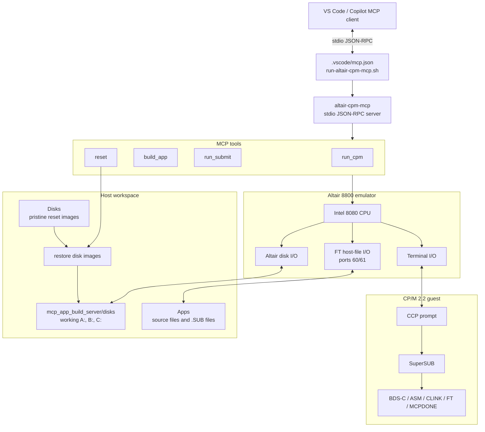

# Altair CP/M MCP Server

This folder builds a stdio MCP server that boots the existing Altair 8800
emulator core into CP/M 2.2 and exposes four tools:

- `run_cpm` sends terminal input to the current CP/M session and returns output.
- `build_app` runs the standard reset, `ft -g <app>/<app>.sub`, `submit <app>`,
  and submit-advance loop until `MCP-TOOL-COMPLETED <APP>` appears.
- `run_submit` runs an arbitrary submit workflow such as `BUILDALL.SUB` in one
  call, stopping at a configurable completion marker. If `fetch` is omitted it
  tries `<submit>.sub`, then falls back to `<submit>/<submit>.sub`.
- `reset` restores fresh disk images and reboots CP/M to `A>`.

## Architecture



Drives are mounted as:

- `A:` `disks/cpm63k.dsk`
- `B:` `disks/bdsc-v1.60.dsk`
- `C:` `disks/blank.dsk`

Build:

```sh
cmake -S mcp_app_build_server -B mcp_app_build_server/build
cmake --build mcp_app_build_server/build
```

Windows native MSVC build from a "Developer PowerShell for VS" prompt:

```powershell
cmake -S mcp_app_build_server -B mcp_app_build_server/build-msvc -G "Visual Studio 17 2022" -A x64
cmake --build mcp_app_build_server/build-msvc --config Release
```

For Windows on Arm64, use:

```powershell
cmake -S mcp_app_build_server -B mcp_app_build_server/build-msvc-arm64 -G "Visual Studio 17 2022" -A ARM64
cmake --build mcp_app_build_server/build-msvc-arm64 --config Release
```

To build both Windows host tools together, use the shared helper from the repo root or the `scripts` folder:

```powershell
.\scripts\build-host-tools-windows.cmd
```

That script builds both `local_altair` and `mcp_app_build_server` in the matching MSVC build directories.

Run from the `mcp_app_build_server` folder so the default disk paths resolve:

```sh
./build/altair-cpm-mcp
```

On Windows, run the generated executable from the matching build configuration, for example:

```powershell
.\mcp_app_build_server\build-msvc\Release\altair-cpm-mcp.exe
```

On Windows on Arm64, run:

```powershell
.\mcp_app_build_server\build-msvc-arm64\Release\altair-cpm-mcp.exe
```

The executable also accepts explicit disk paths:

```sh
./build/altair-cpm-mcp disks/cpm63k.dsk disks/bdsc-v1.60.dsk disks/blank.dsk
```

For `reset`, the executable restores from pristine source images. By default
those are `../Disks/cpm63k.dsk`, `../Disks/bdsc-v1.60.dsk`, and
`../Disks/blank.dsk`. You can override them after the working disk paths:

```sh
./build/altair-cpm-mcp \
  disks/cpm63k.dsk disks/bdsc-v1.60.dsk disks/blank.dsk \
  ../Disks/cpm63k.dsk ../Disks/bdsc-v1.60.dsk ../Disks/blank.dsk
```

The MCP tool input is terminal text. Newlines are sent to CP/M as carriage
returns, so multi-command input such as `b:\ndir` works.

`MCPDONE.COM` is deployed on the BDS-C tools disk. Submit files can use it as
their final command:

```text
mcpdone breakout
```

It prints a stable completion marker:

```text
MCP-TOOL-COMPLETED BREAKOUT
```

Build tools include elapsed time in milliseconds on their final status line,
for example:

```text
BUILD RESULT: PASS (530 ms) - MCP-TOOL-COMPLETED BREAKOUT
SUBMIT RESULT: PASS (2888 ms) - MCP-TOOL-COMPLETED BUILDALL
```
